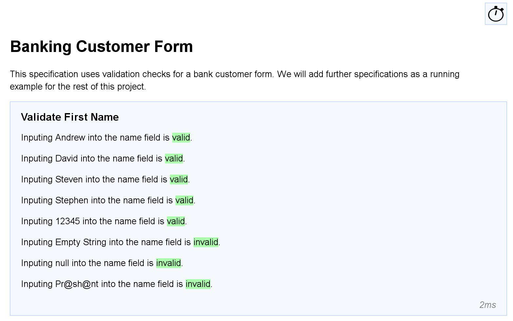
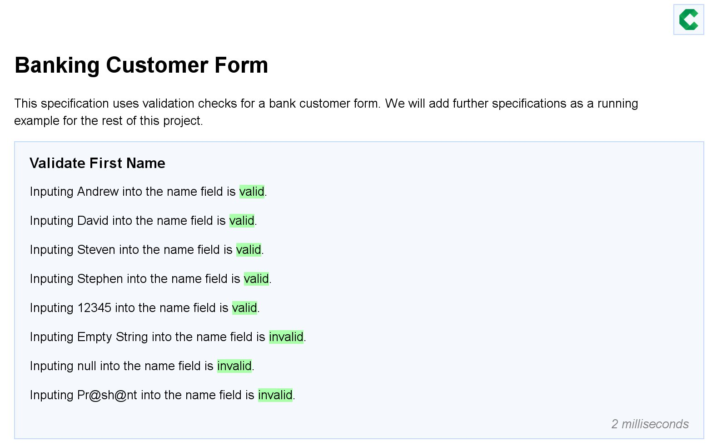
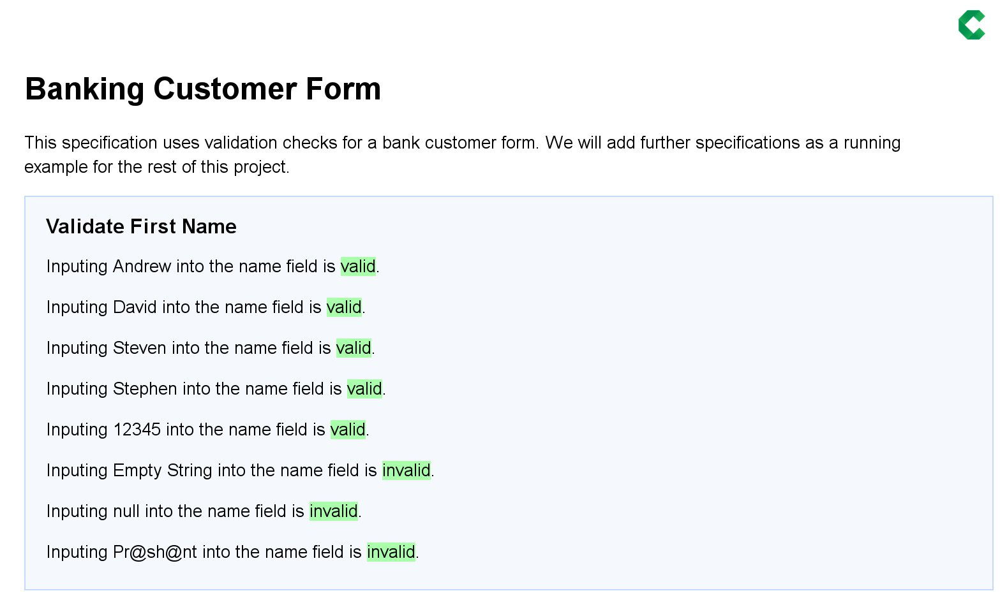

[](https://travis-ci.org/concordion/concordion-timing-extension)

This [Concordion](http://www.concordion.org) extension provides the capability to embed the processing time
of each specification example at runtime.

The [demo project](https://github.com/concordion/concordion-timing-extension-demo) demonstrates this extension.

# Introduction

Often it is useful to know how long a given example takes to run. This extension provides this by printing the
timing to screen for each example. The functionality can be toggled on or off via a toggle button located at the top
right of the results screen.

## How to install

Add to `dependencies`

```groovy
 testCompile 'org.concordion:concordion-timing-extension:0.2.0'
```
## How to use

Add to your test fixture on of these options

With no configuration

```java
@Extensions(value = TimerExtension.class)
```

With comprehensive configuration

```java
@Extension
ConcordionExtension TimingExtension = new TimerExtension()
    .withShowByDefault(true)
    .withIcon("/path/to/icon.png")
    .withTimeFormat(new SimpleTimeFormatter(" hours", " minutes", " seconds", " milliseconds"));
```

# Features

## Timings per example

 


## Customisable timing format and toggle icon

 

## Toggle display of timings

 


# Other Extension Compatibility 
##  Compatible Extensions
- [Parallel Runnner Extension](https://github.com/concordion/concordion-parallel-run-extension)
- [Run Totals Extension](https://github.com/concordion/concordion-parallel-run-extension)
- [Screenshot Extension](https://github.com/concordion/concordion-screenshot-extension)
- [Storyboard Extension](https://github.com/concordion/concordion-storyboard-extension)
- [Input Style Extension](https://github.com/concordion/concordion-input-style-extension)
- [Timestamp Formatter](https://github.com/concordion/concordion-timestamp-formatter-extension)
##  Incompatible Extensions
- [Excel Alternative Specificiation Type Extension](https://github.com/concordion/concordion-excel-extension/)


# Further info

<!-- * [Specification](https://github.com/concordion/concordion-timing-extension-demo/spec/spec/concordion/ext/storyboard/Storyboard.html) -->
<!-- * [API](http://concordion.github.io/concordion-storyboard-extension/api/index.html) -->
* [Demo project](https://github.com/concordion/concordion-timing-extension-demo)
