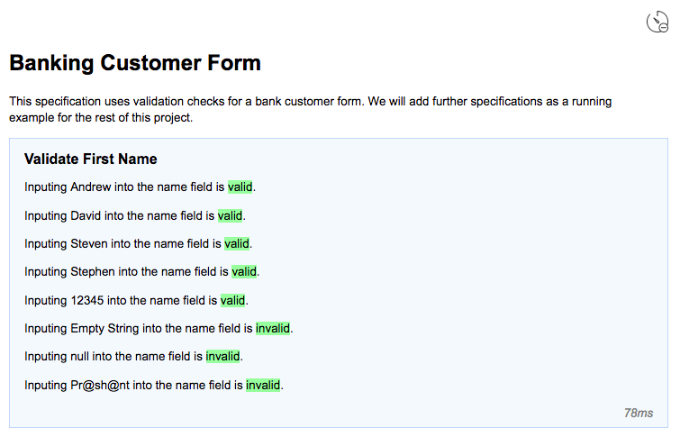
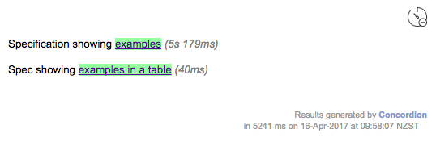

[](https://travis-ci.org/concordion/concordion-timing-extension)
[](http://www.apache.org/licenses/LICENSE-2.0.html)

This [Concordion](http://www.concordion.org) extension provides the capability to embed the processing time
of each specification example at runtime.

The [demo project](https://github.com/concordion/concordion-timing-extension-demo) demonstrates this extension.

# Introduction

Often it is useful to know how long a given example or specification takes to run. This extension provides this by printing the
timing to screen for each example and specification that is run. The functionality can be toggled on or off via a toggle button located at the top
right of the output specification.

## How to install

Add to `dependencies`

```groovy
 testCompile 'org.concordion:concordion-timing-extension:1.1.0'
```
## How to use

For the timings to show on examples, you must be using the example command in your specification ([Markdown format](http://concordion.org/instrumenting/java/markdown/#example-command), [HTML format](http://concordion.org/instrumenting/java/html/#example-command)).

Add to your test fixture one of these options

With no configuration

```java
@Extensions(value = TimerExtension.class)
```

With comprehensive configuration

```java
@Extension
ConcordionExtension TimingExtension = new TimerExtension()
    .withShowByDefault(true)
    .withOnIcon("/path/to/icon-on.png")
    .withOffIcon("/path/to/icon-off.png")
    .withTimeFormat(new SimpleTimeFormatter(" hours", " minutes", " seconds", " milliseconds"));
```

# Features

## Timings per example

 

## Timings per example on table

 
 
 ## Timings on run command
 
  

## Customisable timing format and toggle icon

 

## Toggle display of timings

 


# Other Extension Compatibility 

##  Compatible Extensions

- [Parallel Runnner Extension](https://github.com/concordion/concordion-parallel-run-extension)
- [Run Totals Extension](https://github.com/concordion/concordion-parallel-run-extension)
- [Screenshot Extension](https://github.com/concordion/concordion-screenshot-extension)
- [Storyboard Extension](https://github.com/concordion/concordion-storyboard-extension)
- [Input Style Extension](https://github.com/concordion/concordion-input-style-extension)
- [Timestamp Formatter Extension](https://github.com/concordion/concordion-timestamp-formatter-extension)

##  Incompatible Extensions

- [Excel Alternative Specificiation Type Extension](https://github.com/concordion/concordion-excel-extension/)


# Further info

<!-- * [Specification](https://github.com/concordion/concordion-timing-extension-demo/spec/spec/concordion/ext/storyboard/Storyboard.html) -->
<!-- * [API](http://concordion.github.io/concordion-storyboard-extension/api/index.html) -->
* [Demo project](https://github.com/concordion/concordion-timing-extension-demo)
